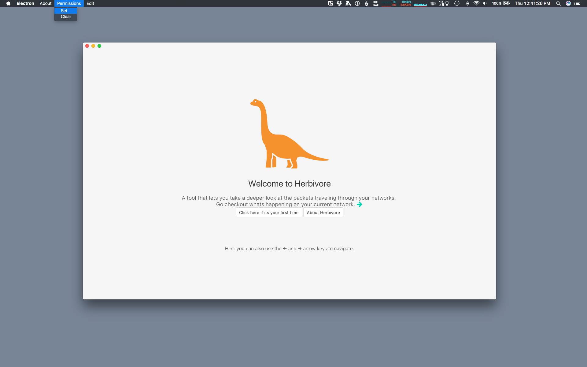
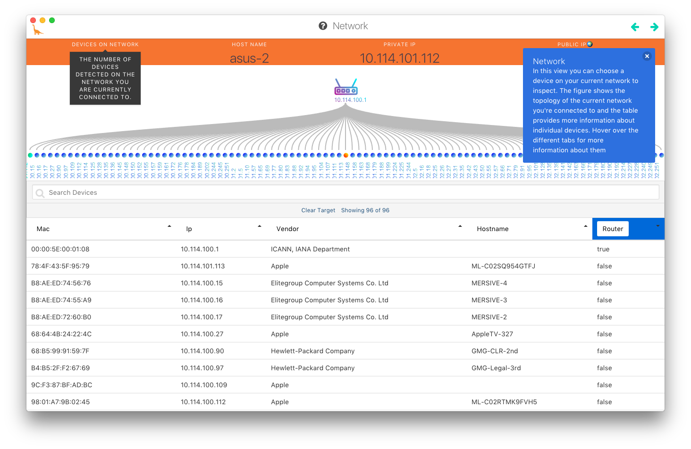

#  Herbivore 

> Packet sniffing made simple

**[Download release](https://github.com/samatt/herbivore/releases)**

**[Clone and build](#Build) **

<u>Important: If you are running Herbivore for the first time be sure to set the necessary permissions.</u>




## What is Herbivore?

Herbivore is a free, open source tool that shows users the data packets that travel between their computers and the internet. By surfacing this information, we hope to demystify how the internet works and make network literacy accessible to a much wider audience.


## What does it do?

Herbivore currently offers users two ways for understanding the network they’re connected to: 

* ####Network View
  *  The Network View is made up of a device diagram on the top half of the screen, which describes the user’s network visually, and a Device Table on the lower half, which describes the user’s network as a list of devices

  

  ​

* #### Sniffer View

  * The Sniffer View is made up of a Packet Table and Packet Details. When the user clicks a specific packet in the packet table, the contents of that packet become visible. 

		


## What is a packet sniffer 

Tools that allow you to see data packets that go through your compupter and the rest of your local network are called “packet sniffers.” 


## Why did you make one?

A handful of packet sniffing libraries and desktop applications already exist for analyzing network packets, but they were designed for people who have programming experience or a network engineering background; they were not designed as educational tools for people without technical backgrounds. This makes it difficult for non-technical audiences—even journalists, activists, and scholars whose work is about technology and who are familiar with networks in a conceptual way—to navigate the existing  tools. We made Herbivore because we believe access to the data travelling through your local network should not only be accessible by experts and there is value in allowing people to investigate for themselves exactly who their devices are talking to.


## What does Herbivore listen for?

While Herbivore can technically listent to all of the information mentioned above, in this first version it is limited to picking up HTTP and HTTPS traffic. This was done to prevent the activity you are seeing from feeling overwhelming. Often a lot of the traffic on the network is not human readable (for example it is hard to tell that a packet is transmitting a small part of a song being streamed on your speakers by looking at it). The nice thing about the HTTP protocol is that it lets us pay attention to the things our computer is requesting from the server rather than the content itself. An example of this is when you go to a page with an image on it. The request for the image is typically made using an HTTP GET request, we are more interested in this request than the actual image itself. For the more technical crowd all this means is that Herbivore is filtering for TCP packets on port 80 and 443.


## Who Made It?

Herbivore is made and maintained by Surya Mattu and Jen Kagan. Ingrid Burrington, Eve Weinber and Pedro Galvao Cesar De Oliveira have also contributed to the project.


## Build

``` bash
# install dependencies
npm install

# serve with hot reload at localhost:9080
npm run dev

# build electron app for production
npm run build

# lint all JS/Vue component files in `app/src`
npm run lint

# run webpack in production
npm run pack
```

Built using [electron-vue](https://simulatedgreg.gitbooks.io/electron-vue/en/)

